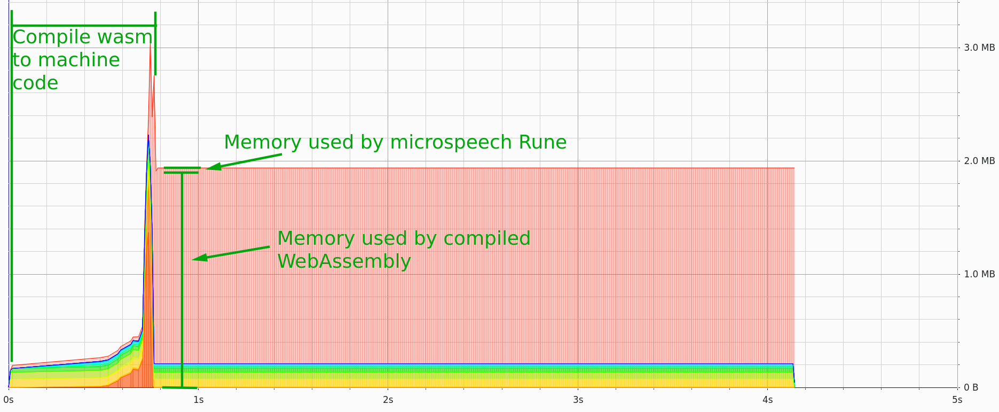

# Exploration and Experiments

A grab bag of interesting information we’ve discovered while implementing Rune.

## Wasmer Memory Overhead

The `wasmer` library compiles WebAssembly to machine code when we instantiate
our Runtime. This means we get near-native performance, but also need to
include an entire compiler and pay the (speed and memory) costs of
compilation every time the Runtime is instantiated.

Evaluating our "microspeech" Rune 1000 times and monitoring overall memory
usage with [heaptrack][ht] shows:

- About 1 second of compilation time before we can start executing the Rune
- Compilation uses around 3MB
- After compiling, memory usage drops to about 1.9MB (presumably the memory
  associated with any compilation artifacts)
- There is a tiny increase in memory usage (about 50 kb - you can’t really
  tell) as we start executing the Rune, indicating that the "microspeech" Rune
  only uses about 50 kb at runtime

This is significant because we could sacrifice runtime speed for lower memory
usage on low memory devices (e.g. Arduino, STM32) by switching to an
interpreted WebAssembly runtime like [`wasm3`][w3] or [`wasmi`][wi].

Interpreters have considerably less overhead (mainly the WebAssembly stack,
which we need anyway), so that means our current Runes are probably usable on
embedded devices.

[ht]: https://github.com/KDE/heaptrack
[w3]: https://github.com/wasm3/wasm3
[wi]: https://github.com/paritytech/wasmi
