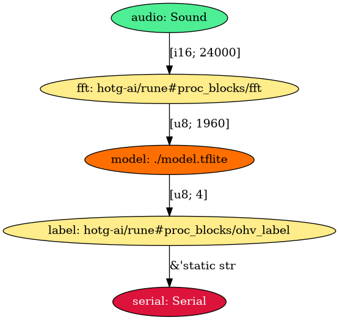

# What's in a Rune?

So you've just discovered this new technology called *Rune* and are excited
to use it in your project, but you don't really know what it does or how to
use it?

If so, this is probably the article for you! Let's explore the concepts and
abstractions that Rune is built on.

Before we can dive into the nuts and bolts of Runes and Runefiles, there's
one very important question that needs to be asked...

## What Problem Does It Solve?

Being interesting isn't normally a sufficient reason to adopt a new
technology. Instead, you'll often have a particular problem that needs
solving or have an application in mind, and when evaluating whether to use a
technology it's a good idea to understand the problems it's trying to solve.

To summarise it in a single sentence,

> Rune is an orchestration tool for specifying how data should be processed,
> with an emphasis on the machine learning world, in a way which is portable
> and robust.

There's a lot to unpack here, so let's step through bit by bit.

> a technology for specifying how data should be processed

The main purpose of a Rune is to give developers in the fields of machine
learning and data processing a way to declare how data should be transformed
using a high level, declarative language.

Instead of needing to write code that manipulates data or needs to interface
with complex third party libraries for receiving inputs, you write a Runefile
which declares each processing step and defers their implementation to the
Rune runtime. This runtime then takes care of interfacing with the outside
world and can leverage existing third party libraries for data manipulation.

> with an emphasis on the machine learning world

One of the applications that prompted Rune's creation was machine learning.

In machine learning there are often several pre- and post-processing steps
required to turn inputs into a form that is usable for a machine learning
model and interpreting the results. These steps tend to be a distraction from
the actual machine learning and are often cumbersome or boring to implement,
so Rune comes with several built-in facilities specific to ML.

> in a way which is portable

The magic behind Runes is that they get compiled to a WebAssembly library
which is loaded by a WebAssembly runtime for execution.

This means any platform which can run WebAssembly can run a Rune. You can
call a Rune from JavaScript in the browser, integrate it into a mobile app,
or even use a lightweight WebAssembly runtime to run your Rune on memory
constrained environments like an Arduino or STM32.

> and robust

A big part of using WebAssembly is that the Rune is entirely sandboxed from
the outside world. A faulty Rune can't accidentally bring down the rest of
the application and can only access resources explicitly given to it by the
Rune runtime.

Both the Rune runtime and the Rune itself are written in Rust. This lets us
leverage the language's strong type system and concepts like `unsafe` and the
borrow checker to ensure correctness and protect against a lot of memory and
concurrency bugs found in other systems languages.

## Designing a Pipeline

To explore the main concepts in a Rune we are going to walk through the
design process for an application that accepts snippets of audio and tries to
recognise some hard-coded words.

This pipeline will:

1. Ask the Rune runtime for audio data
2. Convert the audio from raw samples to spectrum showing the distribution of
   each frequency (words are easier to recognise in this form)
3. Pass the pre-processed audio to a TensorFlow Lite model
4. Take the list of confidences generated by the model and turn them into
   human-readable labels
5. Print the labelled output to the screen

Written as a Runefile, this would look like

```
FROM runicos/base

CAPABILITY<I16[24000]> audio SOUND --hz 16000 --sample-duration-ms 1500

PROC_BLOCK<I16[24000], U8[1960]> fft hotg-ai/rune#proc-blocks/fft

MODEL<U8[1960], U8[4]> model ./model.tflite

PROC_BLOCK<U8[4], UTF8> label hotg-ai/rune#proc-blocks/ohv_label --labels=unknown,silence,yes,no

OUT serial

RUN main audio fft model label serial
```

The `rune` CLI tool lets you look at a Runefile in visual form. Running it on the above Runefile generates this image:



## The *"FROM"* Directive

The first line, `FROM runicos/base`, tells the Rune runtime which image to
use when loading the Rune.

An *"Image"* declares how a Rune can interact with the outside world, or more
concretely, which functions are exposed to the generated WebAssembly.
Creating your own image is a fairly advanced technique, but it is often
useful when paired with custom *Proc Blocks* or *Capabilities*.

## The *"CAPABILITY"* Directive

*Capabilities* are used to ask the Rune runtime for certain information from the outside world.

Let's look at the next line in our Runefile:

```
CAPABILITY<I16[24000]> audio SOUND --hz 16000 --sample-duration-ms 1500
```

The `CAPABILITY<I16[24000]>` bit tells us that this is a capability which
generates 24000 signed 16-bit integers. Often the `rune` tool is smart enough
to infer what type of data is being generated, in which case we could have
written `CAPABILITY<_>`.

The `audio SOUND` part says we are requesting a `SOUND` capability and giving
it the label, `"audio"`.

Sometimes a capability will accept arguments. This provides the Rune runtime
with extra information about how the data should be generated Rune runtime to
provide 1500 ms of audio data sampled at 16 kHz. On the phone you could
imagine recording 1.5 seconds of data using the microphone, resampling the
audio if necessary to provide the appropriate number of samples.

There are several capabilities available, with their parameters and behaviour
documented in more detail in the `runic-types` crate's API docs. The
capabilities that are currently supported are:

- `RAND` - Generate a buffer full of random data
- `SOUND` - Pulse-Code Modulated 16-bit audio
- `ACCEL` - The X, Y, and Z components of the device's accelerometer
- `IMAGE` - An image with a particular size

See the tutorial on [creating a custom *Image*][custom-image] for tips on implementing an existing capability or creating your own.

## The *"PROC_BLOCK"* Directive

You'll often need to do pre- and post-processing of data, and for these we use *Procedural Blocks* (*Proc Block* for short). A *Proc Block* is just a Rust library which gets linked into the Rune and executed at the corresponding step in the pipeline.

```
PROC_BLOCK<I16[24000], U8[1960]> fft hotg-ai/rune#proc-blocks/fft
```

This *Proc Block* accepts the 24000-element array of signed 16-bit integers from before and outputs a 1960-element array of 8-bit unsigned integers.

Similar to the *Capability* directive, after the label (`fft`) there is an argument specifying which type of *Proc Block* to use. However, unlike the simple `SOUND` identifier we have a more complicated thing called a *Path*.

A *Path* tells `cargo` (the Rust package manager) exactly where to find the *Proc Block's* code and which version to use. It can accept a wide range of inputs, including

- `fft` - the name of a crate on [crates.io][crates], defaulting to the latest
  version
- `fft@1.0` - version 1.0 of the `fft` crate on crates.io
- `hotg-ai/fft` - the default crate in the `hotg-ai/fft` repository on GitHub
- `hotg-ai/rune#proc-blocks/fft` - the crate inside `proc-blocks/fft/` in the `hotg-ai/fft` GitHub repository
- `https://github.com/hotg-ai/rune@v1.0#proc-blocks/fft` - the crate inside `proc-blocks/fft/` in the provided git repository, checking out the `v1.0` revision

*Proc Blocks* can also accept optional arguments using the same syntax as *Capabilities*.

The built-in *Proc Blocks* are in [the `proc-blocks/` folder][pb] of the `rune` repo, with some commonly used *Proc Blocks* being:

- `fft` - Apply the Fast Fourier Transform to 16-bit PCM audio samples
- `modulo` - Apply the modulo operation to every element in the buffer
- `normalize` - scale each element in the provided buffer to the range `[0, 1]`
- `ohv_label` - Given a list of labels and a list of confidences, get the label
  that corresponds to the highest confidence

As *Proc Blocks* are just normal Rust crates; see the tutorial on [creating a
*Proc Block*](custom-proc-block) for a guide on writing your own.

## The *"MODEL"* Directive

The most important part of any machine learning application is running a
model on your data. Let's look at the `MODEL` directive from our Runefile to
see how that works.

```
MODEL<U8[1960], U8[4]> model ./model.tflite
```

Just like *Proc Blocks* and *Capabilities*, the *Model* directive starts off
with the `MODEL` keyword followed by the type and dimensions of its inputs
and outputs.

We give it a label of `model` and tell Rune to use the `model.tflite` model
in the same directory as the Runefile. This is the path to an existing
[*TensorFlow Lite*][tfl] model that a machine learning engineer may have
trained earlier.

At a minimum, all platforms should support *TensorFlow Lite*, but the exact
list of supported model formats will change depending on how the model is
executed (some can be run directly inside WebAssembly, while others may ask
the runtime to execute the model directly on the host - meaning it may only
run on certain platforms).

## The *"OUT"* Directive

Arguably the most important part of all this data processing is making sure
the data goes *somewhere* so it can be consumed by something else (e.g. a
mobile app or embedded device).

The directive itself is rather simple, you declare a `SERIAL` output by
simply writing

```
OUT serial
```

The `SERIAL` output sends the data to the host as JSON so it may be written
to a serial connection or UI.

## The *"RUN"* Directive

Up until now we've only been declaring the different processing stages in our
Runefile, but the `RUN` directive is what ties everything together.

You simply write `RUN` then each stage's label in the order they should be executed.

```
RUN audio fft model label serial
```

The system is even smart enough to detect when you've tried to connect
incompatible stages (imagine stage A generates a 1024-element array of
floats, but stage B only accepts integers) and will fail the build with a
build error.

## Conclusion

While we didn't write any code in this article, hopefully you'll have a
better understanding of how a Rune works and what they are capable of.

[crates]: https://crates.io/
[tfl]: https://www.tensorflow.org/lite
[pb]: https://github.com/hotg-ai/rune/tree/master/proc-blocks
[custom-image]: #
[custom-proc-block]: #
