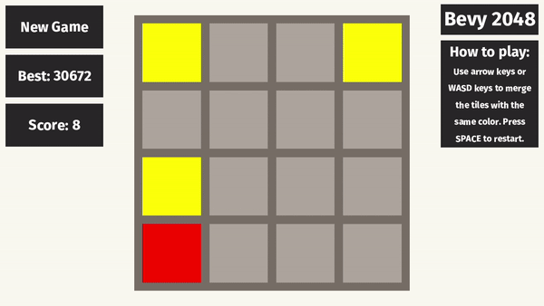

# bevy_2048
2048 clone created with Bevy game engine.

I made this game because I wanted to get better at Rust and learn the new engine [Bevy](https://bevyengine.org/).
It was fun to make this game and I learned a lot about Rust and Bevy.
I think Bevy has a lot of potentials, and it's now one of my favorite game engines.

## Notes
- This game was made at first with bevy 0.2.1 and then was upgraded to bevy 0.3.0.
- I have no intention to continue developing it.

## Running using cargo
- Install Cargo. (You can look at the book [here.](https://doc.rust-lang.org/cargo/getting-started/installation.html))

- Clone or download this project. 
Cloning using git: `$ git clone https://github.com/MeirKlemp/bevy_2048`

- Run the game through cargo: `$ cargo run --release`

## TODOS
You can see the whole list [here.](./TODO.md)